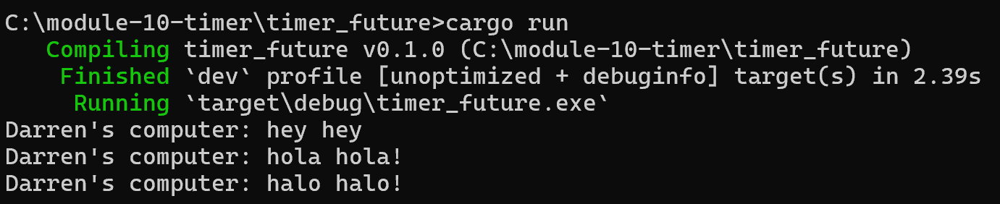
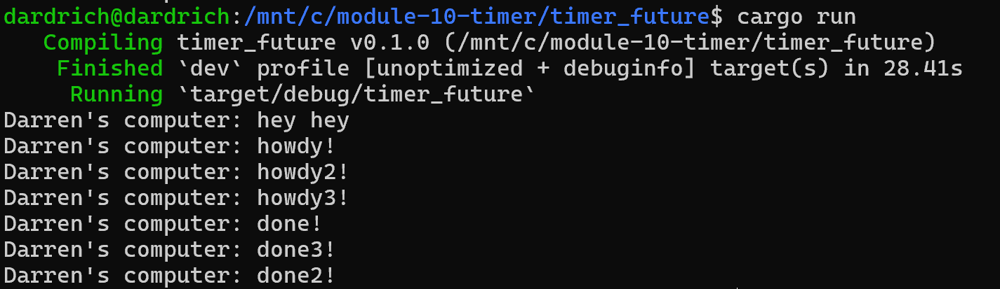
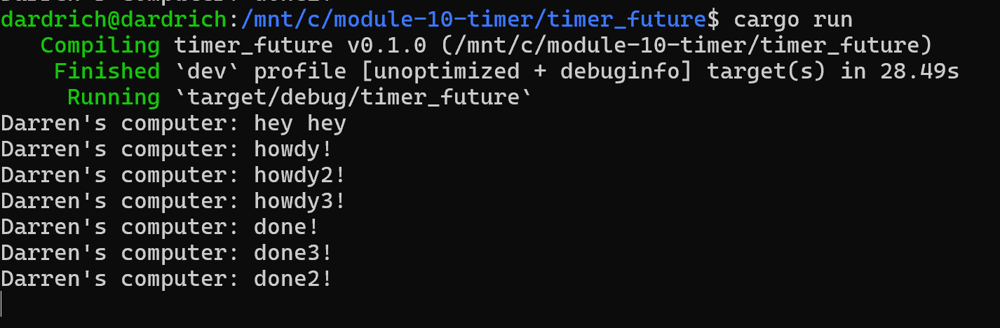

# Module 10 Reflection

### Add another print just after the spawn

As we can see, the program prints "hey hey" (the text outside the spawner) first, followed by "hola hola!" and "halo halo!".
"hey hey" is printed first because it's part of the synchronous code that gets executed immediately when the function runs.
Meanwhile, "hola hola!" and "halo halo!" are inside the spawner as asynchronous tasks — they are queued and wait to run until `executor.run()` is called.

### Multiple spawn

When we run the code, "hey hey" prints first because it's normal code that runs right away.
Then, when `executor.run()` is called, the async tasks start running in the order they were created. Each one prints its "howdy" message before waiting on a 2-second timer.
After the timers finish, the tasks continue and print their "done" messages. But they don’t always finish in the same order they started. For example, we might see "done!", then "done3!", then "done2!". This shows that the last task to wake up can finish first, because the executor picks up recently-ready tasks in reverse order (LIFO).

### Remove `drop(spawner)`

When we commented `drop(spawner)` out, the program won’t stop on its own.
Even though all tasks run and print their messages ("howdy" in order, "done" in reverse), the program just hangs afterward.
That’s because the executor is still waiting for new tasks. Without dropping the spawner, it thinks more tasks might come, so it never stops.
By adding `drop(spawner)`, we tell the program, “no more tasks are coming,” so it knows it’s safe to exit once everything is done.